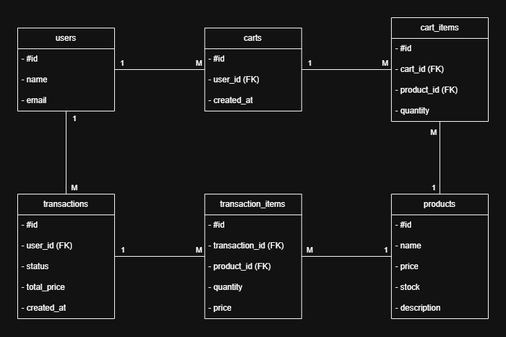

# Jawaban Pre-Test

## Knowledge Based

1. Apa yang anda ketahui tentang Rest API?

   REST API adalah antarmuka komunikasi berbasis HTTP yang menggunakan metode CRUD (Create, Read, Update, Delete) seperti GET, POST, PUT, dan DELETE untuk mengakses dan memanipulasi data.

2. Apa yang anda ketahui tentang Server side and Client side processing?

   Server side processing adalah pemrosesan data yang dilakukan di backend server, seperti database atau autentikasi. Client side processing adalah pemrosesan yang dilakukan pada frontend atau browser, seperti validasi form, tampilan, atau animasi. Keduanya harus saling melengkapi baik untuk keamanan dan user experience.

3. Apa yang anda ketahui tentang Monolith dan Microservices, berikan contohnya?

   Monolith adalah pendekatan membangun aplikasi dalam satu kesatuan, contohnya aplikasi yang kecil dengan beberapa fitur dijalankan dalam satu server. Microservices adalah pendekatan membagi aplikasi menjadi service-service kecil yang terpisah, contohnya aplikasi besar seperti e-commerce, di mana layanan pembayaran, katalog, dan user dikelola di service yang berbeda.

4. Apa yang anda ketahui tentang Design pattern inversion of Control serta Dependency Injection?

   Inversion Of Control adalah prinsip dimana semua alur kontrol dibalik dari dalam ke luar, bukan class yang membuat dependensinya sendiri. Dependency Injection adalah implementassi dari IoC, yaitu cara sebuah class mengambil objek (dependensi) dari luar, biasanya lewat constructor, setter, atau field.

5. Apa yang anda ketahui tentang Java programming dan Spring framework khususnya spring-boot?

   Java adalah bahasa pemrograman berbasis OOP yang digunakan untuk aplikasi backend, web, dan mobile. Spring Framework adalah framework Java yang membantu membuat aplikasi dengan lebih mudah dan terstruktur, terutama dalam hal dependency injection dan konfigurasi. Spring Boot adalah bagian dari Spring yang mempermudah pembuatan aplikasi Spring dengan konfigurasi minimal dan embedded server seperti Tomcat.

## Design Module


ERD menjelaskan alur dari user yang memiliki cart berisi beberapa produk, lalu melakukan transaksi yang menyimpan detail produk yang dibeli. Produk disimpan terpisah dan direferensikan dari cart dan transaksi.
Monolith dipilih untuk kecepatan pengembangan dan deployment awal. Lebih mudah dikelola karena satu codebase

# Backend E-Commerce

Aplikasi backend e-commerce sederhana. Fitur utama:

- Katalog produk
- Manajemen keranjang belanja
- Checkout dan transaksi

## Skema Database

**Tabel utama:**

- `users`: Data pengguna
- `products`: Informasi produk dan stok
- `carts`: Keranjang belanja
- `cart_items`: Daftar produk dalam keranjang
- `transactions`: Riwayat transaksi
- `transaction_items`: Rincian item dalam transaksi

## Cara Menjalankan

### Prasyarat

- JDK 21
- PostgreSQL dengan DB bernama `ecommerce`
- Postman (untuk testing API)

### Langkah Menjalankan

1. Clone repo atau extract zip
2. Buka `src/main/resources/application.yml`, ubah:
   ```yaml
   spring:
     datasource:
       url: jdbc:postgresql://localhost:5432/ecommerce
       username: postgres
       password: your_password
     jpa:
       hibernate:
         ddl-auto: create-drop
       show-sql: true
       properties:
         hibernate:
           format_sql: true
   ```
3. Jalankan aplikasi melalui `DemoApplication.java`
4. Akses API di: `http://localhost:8080/api`

## Endpoint Utama

### Produk

- `GET /products`: Lihat semua produk
- `GET /products/{id}`: Lihat produk by ID
- `POST /products`: Tambah produk
- `PUT /products/{id}`: Update produk
- `DELETE /products/{id}`: Hapus produk

### Keranjang

- `GET /cart/{userId}`: Lihat / buat keranjang user
- `POST /cart/{userId}/add?productId=...&quantity=...`: Tambah produk ke keranjang
- `PUT /cart/{userId}/update?productId=...&quantity=...`: Ubah jumlah produk di keranjang
- `DELETE /cart/{userId}/remove/{productId}`: Hapus produk dari keranjang

### Transaksi

- `POST /checkout/{userId}`: Checkout dan transaksi
- `GET /transactions/{userId}`: Riwayat transaksi user
- `GET /transactions/details/{transactionId}`: Detail transaksi
